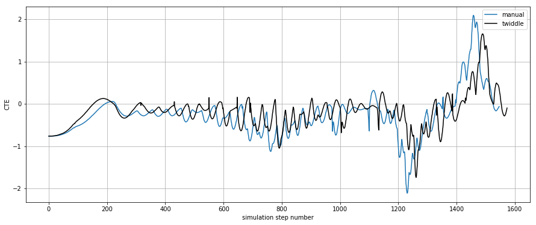

# PID Controller for Vehicle Control

In this project a PID controller is used to calculate steering inputs for a virtual vehicle driving on a simulated test track.
The error metric used for the PID controller is the cross track error (CTE) which is defined as the shortest distance between the test track center line and the vehicles current position.

# Parameter Tuning

In order to safely guide the vehicle along the test track, appropriate values vor the P-, I- and D-gain values have to be chosen.

## Influence of I-Term

An appropriately chosen I-gain will help to counteract permanent deviations from the desired target point (resulting e.g. from changing environmental factors).
Choosing a too large I-gain on the other hand will often lead to oscillations around the target control point. 
As in this project the PID controller is tested in a simulated environment, there are no noticable factors present which might lead to permanent deviations from the target point.
The I-gain is therefore chosen to be zero.

## PD Tuning

My goal was to manually find some initial values for the P- and D-gains and subsequently search for better values using optimization.
I therefore implemented the twiddle algorithm from the lecture to perform this optimization automatically. 

### Manual tuning

I started off using only a P-controller to steer the vehicle along the track.
While I was able to slowly follow the test track, the vehicle was overshooting the target point (middle of the road) all the time, i.e. it was oscillating around it.
I therefore could not increase the velocity very much, without the vehicle leaving the track due to wild oscillations.

I then added a D-term to the controller.
This term is used to counteract the overshoot and oscillations induced by the pure P-controller by considering how fast the error is changing and influencing the controller output accordingly.
After some further parameter tuning the vehicle was now able to follow the road much more smoothly and with higher velocity.

In the end I settled for the values 0.15 as P-gain and 3.0 as D-gain values of my PD-controller.

### Parameter Optimization 

Starting from the values above I used twiddle to further optimize the vehicle controller.
As a quality measure for twiddle I used the RMSE of the CTE over 3000 steps of the simulation starting from step 800.
The algorithm was able to decrease the RMSE value quite a bit and in the end (i.e. when the gain values were not being changed much anymore) settled for 0.24 as P-gain and 3.2 as D-gain value.
While the RMSE using these controller parameters was indeed smaller, I noticed that the vehicle was subjectively oscillating a bit more and genereally seemed to be not as stable as before.

This phenomenon can be explained by looking at the quality measure that was used for twiddle.
It seems that only using the RMSE of the CTE might not be the best choice for achieving the best vehicle behavior.
The RMSE only considers the absolute value of the CTE, but not how it is changing over time and therefore is ignoring oscillations.
A solution for this problem might be to extend the twiddle quality measure by some quantity measuring the smoothness of the vehicles motion (e.g. by considering the derivative of the CTE).

The following plot shows a comparison of the CTE values for the manually tuned PD-controller and the one optimized using twiddle:

 
It can be seen that in the beginning the twiddle controller reaches the middle of the road (i.e. CTE=0) faster because of its bigger P-gain value.
The smaller RMSE value of the twiddle controller can also be recognized by looking at the area between the x-axis and the CTE curves.
 
 

